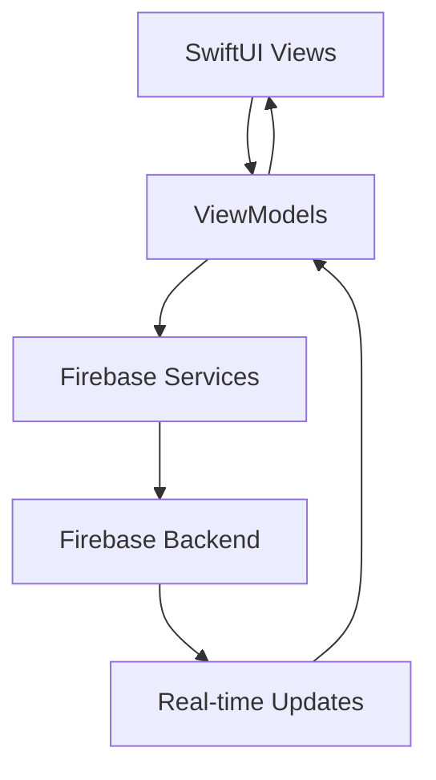

# 🚀 PawMap Firebase Architecture Transformation Summary

## 📋 **Overview**

This document summarizes the complete transformation of PawMap from a local-only SwiftUI prototype to a production-ready, multi-user Firebase-backed application.

## 🏗️ **Architecture Transformation**

### **Before (Current State)**
```
PawMap (Local Only)
├── UserDefaults (Data Storage)
├── Hardcoded Sample Data
├── Simulated Authentication
├── Local Image Storage
└── Single User Experience
```

### **After (Firebase Architecture)**
```
PawMap (Firebase Backend)
├── Firestore (Real-time Database)
├── Firebase Auth (Multi-provider)
├── Firebase Storage (Cloud Images)
├── Cloud Functions (Backend Logic)
└── Multi-user Real-time Experience
```

## 📁 **New Project Structure**

```
PawMap/
├── Models/
│   ├── Place.swift (Firebase-ready)
│   ├── Review.swift (Enhanced)
│   ├── User.swift (New)
│   └── CuratedPlace.swift (Existing)
│
├── ViewModels/
│   ├── PlaceViewModel.swift (Firebase integration)
│   ├── AuthViewModel.swift (Firebase Auth)
│   ├── FavoritesViewModel.swift (Real-time sync)
│   └── TopPicksViewModel.swift (Curated content)
│
├── Services/
│   ├── FirebaseService.swift (Base service)
│   ├── AuthService.swift (Authentication)
│   ├── StorageService.swift (Image handling)
│   └── LocationService.swift (Refactored)
│
├── Utils/
│   ├── ImageCache.swift (Performance)
│   └── ErrorHandler.swift (Error management)
│
├── Configuration/
│   ├── FirebaseConfig.swift (Setup)
│   └── AppConstants.swift (Configuration)
│
└── Views/ (Updated for Firebase)
    ├── Map/
    ├── Places/
    ├── Reviews/
    ├── Profile/
    ├── Favorites/
    └── TopPicks/
```

## 🔄 **Data Flow Architecture**

### **SwiftUI → ViewModels → Services → Firebase**



### **Key Components**

1. **ViewModels**: Handle business logic and state management
2. **Services**: Abstract Firebase operations
3. **Real-time Updates**: Automatic UI synchronization
4. **Error Handling**: Comprehensive error management
5. **Offline Support**: Firestore persistence

## 🗄️ **Firestore Collections**

### **Core Collections**
- **`places`**: Dog-friendly locations with real-time updates
- **`reviews`**: User reviews and ratings
- **`users`**: User profiles and preferences
- **`favorites`**: User favorite places
- **`curatedPlaces`**: Admin-curated Top Picks

### **Supporting Collections**
- **`reports`**: Content moderation
- **`userStats`**: User contribution statistics
- **`userPreferences`**: User settings
- **`admins`**: Admin user management

## 🔐 **Security Implementation**

### **Firestore Security Rules**
```javascript
// Places: Read-all, Write-authenticated
match /places/{placeId} {
  allow read: if true;
  allow create: if request.auth != null;
  allow update: if request.auth != null && 
                   request.auth.uid == resource.data.createdBy;
}

// Users: Read/Write own data only
match /users/{userId} {
  allow read, write: if request.auth != null && 
                        request.auth.uid == userId;
}
```

### **Storage Security**
```javascript
// User images: Own data only
match /users/{userId}/{allPaths=**} {
  allow read, write: if request.auth != null && 
                        request.auth.uid == userId;
}

// Place images: Read-all, Write-authenticated
match /places/{placeId}/{allPaths=**} {
  allow read: if true;
  allow write: if request.auth != null;
}
```

## 🚀 **Key Features Implemented**

### **1. Real-time Data Synchronization**
- Places update across all users instantly
- Reviews appear in real-time
- Favorites sync across devices

### **2. Multi-provider Authentication**
- Email/Password
- Apple Sign-In
- Google Sign-In
- Secure user sessions

### **3. Cloud Image Storage**
- Firebase Storage integration
- Automatic image compression
- Local caching for performance
- CDN delivery

### **4. Advanced Place Management**
- User-generated content
- Real-time rating updates
- Content moderation system
- Report handling

### **5. Top Picks System**
- Algorithm-based ranking
- Admin curation
- National vs. Local favorites
- Cloud Functions automation

## 📊 **Performance Optimizations**

### **Image Handling**
- Local caching with `ImageCache`
- Automatic compression
- Lazy loading
- CDN delivery

### **Data Management**
- Firestore persistence
- Offline support
- Pagination for large datasets
- Efficient queries

### **Real-time Updates**
- Selective listening
- Debounced updates
- Connection state management
- Error recovery

## 🔧 **Cloud Functions**

### **Automated Tasks**
1. **Top Picks Ranking**: Daily algorithm-based ranking
2. **Content Moderation**: Automatic flagging of reported content
3. **Rating Updates**: Real-time rating calculations
4. **Data Cleanup**: Weekly maintenance tasks
5. **User Statistics**: Contribution tracking

### **Event-driven Functions**
- Review creation → Rating update
- Report submission → Moderation check
- User deletion → Data cleanup
- New user → Welcome email

## 📱 **User Experience Improvements**

### **Authentication Flow**
```
App Launch → Splash Screen → Map View
                ↓
         [Not Authenticated]
                ↓
         Login/Signup Options
                ↓
         [Authenticated]
                ↓
         Full App Access
```

### **Real-time Features**
- Instant place updates
- Live review notifications
- Synchronized favorites
- Real-time chat (future)

### **Offline Experience**
- Cached data access
- Offline place viewing
- Sync when reconnected
- Graceful degradation

## 🧪 **Testing Strategy**

### **Unit Tests**
- ViewModel logic
- Service methods
- Data validation
- Error handling

### **Integration Tests**
- Firebase connectivity
- Authentication flow
- Real-time updates
- Image upload/download

### **UI Tests**
- User workflows
- Navigation
- Form validation
- Error states

## 📈 **Analytics & Monitoring**

### **Firebase Analytics**
- User engagement tracking
- Feature usage metrics
- Performance monitoring
- Crash reporting

### **Custom Events**
```swift
Analytics.logEvent("place_viewed", parameters: [
    "place_id": place.id,
    "place_type": place.type.rawValue
])
```

## 🚀 **Deployment Strategy**

### **Phase 1: Core Migration**
1. Firebase project setup
2. Basic authentication
3. Place data migration
4. Real-time updates

### **Phase 2: Advanced Features**
1. Image storage
2. Review system
3. Favorites sync
4. Top Picks

### **Phase 3: Production Ready**
1. Security hardening
2. Performance optimization
3. Monitoring setup
4. App Store deployment

## 🔮 **Future Enhancements**

### **Social Features**
- User profiles
- Friend connections
- Social sharing
- Community features

### **Advanced Functionality**
- Push notifications
- Offline maps
- Advanced search
- AI recommendations

### **Business Features**
- Premium subscriptions
- Business partnerships
- Advertising integration
- Analytics dashboard

## 📋 **Migration Checklist**

### **Pre-Migration**
- [ ] Backup current app
- [ ] Document existing features
- [ ] Plan data migration
- [ ] Set up Firebase project

### **Core Migration**
- [ ] Add Firebase SDK
- [ ] Implement authentication
- [ ] Migrate data models
- [ ] Update ViewModels
- [ ] Test basic functionality

### **Advanced Features**
- [ ] Implement image storage
- [ ] Add real-time updates
- [ ] Set up Cloud Functions
- [ ] Configure security rules
- [ ] Performance optimization

### **Production Deployment**
- [ ] Security audit
- [ ] Performance testing
- [ ] User acceptance testing
- [ ] App Store submission
- [ ] Monitoring setup

## 🎯 **Success Metrics**

### **Technical Metrics**
- App performance (load times)
- Crash rate (< 1%)
- API response times
- Offline functionality

### **User Metrics**
- User engagement
- Feature adoption
- User retention
- Review ratings

### **Business Metrics**
- User growth
- Content creation
- Community engagement
- Revenue (future)

## 📚 **Documentation**

### **Developer Documentation**
- Architecture overview
- API documentation
- Code examples
- Best practices

### **User Documentation**
- Feature guides
- Troubleshooting
- FAQ
- Support resources

---

## 🎉 **Conclusion**

This Firebase transformation transforms PawMap from a local prototype into a scalable, production-ready application that can support thousands of users with real-time collaboration, secure authentication, and robust data management. The new architecture provides a solid foundation for future growth and feature development.

The implementation follows iOS and Firebase best practices, ensuring maintainability, performance, and security. The modular design allows for easy testing, debugging, and feature additions.

**Ready to build the future of dog-friendly place discovery! 🐕✨**

